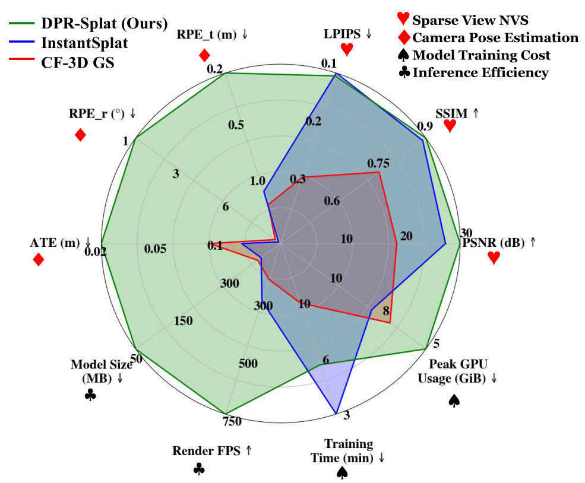
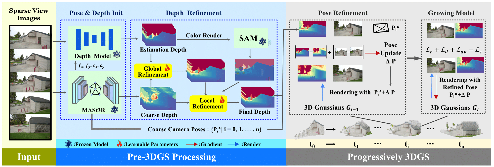

<div align="center">

<h1 align="center">DPR-Splat: Depth and Pose Refinement with Sparse-View 3D Gaussian Splatting for Novel View Synthesis</h1>
<!--   <h2 align="center">ICML 2024</h2> -->
Lingxiang Hu*, Zhiheng Li, Xingfei Zhu, Dun Li, Ran Song

</div>


## 📃 Inroduction

<table>
  <tr>
    <td width="50%">
      
    </td>
    <td width="50%" align="left" valign="top">
      <p style="font-size: 19px;">🚀We propose  <b><span style="color: red;">DPR-Splat</span></b> , an efficient 3D reconstruction system, addressing pose and depth inaccuracies in sparse views.</p>
      <p style="font-size: 17px;">✨ <b>Key advantages of <span style="color: red;">DPR-Splat</span>:</b></p>
      <ul style="font-size: 15px;">
        <li>🖼️ <b>Higher-quality</b> novel view synthesis</li>
        <li>🎯 <b>More accurate</b> pose estimation</li>
        <li>⚡ <b>Faster</b> training and rendering speed</li>
      </ul>
    </td>
  </tr>
</table>

## 🧭 Overview

<p align="center">

</p>

🔧 **Pose & Depth Init**: Generates initial pose and depth for optimization.  
🎯 **Depth refinement**: Improves depth accuracy, facilitating subsequent processing.  
📌 **Pose refinement**: Performed on each frame to achieve more precise pose estimation.  
📈 **Growing model**: Incrementally reconstructs the model using accurate pose and depth.  
## 📽️ Video

<video width="100%" controls>
  <source src="./figure/video.mp4" type="video/mp4">
  Your browser does not support the video tag.
</video>

## 📌 Setup

### Clone this repo

```
git clone https://github.com/h0xg/DPR-Splat.git
```

### Environment setup

It is recommended to manually install some modules here, especially the submodules required by 3DGS.

```
conda create -n DPR python=3.9
conda activate DPR 
pip install -r requirements.txt
```

## 📁 Data Preparation

DATAROOT is `./data` by default. Please first make data folder by `mkdir data`.

### Tanks and Temples

Download the data preprocessed by [Nope-NeRF](https://github.com/ActiveVisionLab/nope-nerf/?tab=readme-ov-file#Data) as below, and the data is saved into the `./data/Tanks` folder.
```bash
wget https://www.robots.ox.ac.uk/~wenjing/Tanks.zip
```

### Mip-NeRF 3640

Please download the data from the [Mip-NeRF 360](https://jonbarron.info/mipnerf360/), and put it to `./data`

## 🎮 Run the codes
```bash
python run.py --config ./configs/tank.yaml --sourcepath ./data/your_scene --save_dir ./output
```
## 📜 Acknowledgement

Thanks to excellent open-source projects like [3D-GS](https://github.com/graphdeco-inria/gaussian-splatting), [MonoGS](https://github.com/muskie82/MonoGS), [Metric3D](https://github.com/YvanYin/Metric3D), [MASt3R](https://github.com/naver/mast3r) and [MobileSAM](https://github.com/ChaoningZhang/MobileSAM), the open-sourcing of this work is a small contribution back to the open-source community.
